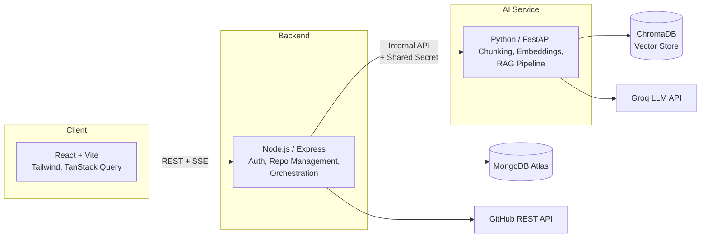

# AI Codebase Assistant

A full-stack RAG (Retrieval-Augmented Generation) application that lets developers connect a GitHub repository and ask natural-language questions about the codebase, with answers grounded in the actual source code via semantic search.

**Live demo:** [code-base-assistance.vercel.app](https://code-base-assistance.vercel.app)

> Note: the AI service runs on free-tier hosting with ephemeral storage — if the vector index appears empty after a period of inactivity, click **Re-index** on the repository before chatting. See [Deployment Notes](#deployment-notes) for why.

---

## What it does

1. Connect a public or private GitHub repository (via an encrypted personal access token)
2. Index it — the backend fetches source files, splits them into semantically meaningful chunks using language-aware parsing, generates vector embeddings, and stores them in a per-repository vector database
3. Ask questions in a chat interface — the system retrieves the most relevant code chunks and streams a grounded answer back in real time, citing the specific files it used

---

## Architecture



**Why three services instead of one backend?** Node handles I/O-bound work (auth, orchestration, CRUD) while Python owns the AI/ML ecosystem (LangChain, ChromaDB, embeddings) — each service scales and deploys independently, and the AI service is never exposed directly to the internet, only reachable through Node via an internal API key.

---

## Key engineering decisions

- **Language-aware code chunking** — instead of naive fixed-size text splitting, code is split using LangChain's language-specific splitters that prefer function/class boundaries, preserving semantic coherence for better retrieval.
- **Per-repository vector isolation** — each indexed repository gets its own ChromaDB collection, so retrieval queries are structurally incapable of leaking chunks across repos or users.
- **Authorization at the data layer, not just the route layer** — every database query is scoped by `owner: userId` at the query level (not just checked in a middleware), closing a common class of IDOR (Insecure Direct Object Reference) vulnerabilities.
- **Encrypted secrets at rest** — GitHub personal access tokens are encrypted with AES-256-GCM before storage and never exposed back to the client after saving.
- **Real-time streaming via SSE** — LLM responses stream token-by-token from Groq → FastAPI → Express → the browser, using a raw Node stream pipe (not buffered), while Express simultaneously taps the same stream to persist the final message to MongoDB — two independent consumers of one stream, with zero added latency to the client.
- **Service-to-service authentication** — the internal AI service requires a shared API key on every request, even though it's not meant to be publicly reachable, as defense-in-depth against network misconfiguration.
- **Deployment-driven architecture swap** — the embedding pipeline originally used `sentence-transformers` (PyTorch-based) locally; hitting a 512MB memory ceiling on free-tier hosting led to swapping in `fastembed` (ONNX-based, no PyTorch) with zero changes to any other part of the RAG pipeline, validating the service abstraction layer built early on.

---

## Tech Stack

**Frontend:** React (Vite), Tailwind CSS, React Router, TanStack Query, Axios

**Backend:** Node.js, Express, MongoDB (Mongoose), JWT Authentication

**AI Service:** Python, FastAPI, LangChain, ChromaDB, FastEmbed, Groq API

**External APIs:** GitHub REST API, Groq LLM API

**Deployment:** Vercel (frontend), Render (backend + AI service), MongoDB Atlas

---

## Project Structure
├── client/ # React frontend
│ └── src/
│ ├── api/ # HTTP client wrappers
│ ├── components/ # Reusable UI components
│ ├── context/ # Auth context
│ ├── hooks/ # React Query hooks
│ ├── pages/ # Route-level pages
│ └── router/
│
├── server/ # Node/Express backend
│ └── src/
│ ├── config/ # Env validation, DB connection
│ ├── controllers/ # HTTP layer
│ ├── middlewares/ # Auth, validation, error handling
│ ├── models/ # Mongoose schemas
│ ├── routes/
│ ├── services/ # Business logic
│ ├── utils/
│ └── validators/ # Zod schemas
│
└── ai-service/ # Python/FastAPI AI service
└── app/
├── api/routes/ # FastAPI routers
├── core/ # Config, security
├── schemas/ # Pydantic models
└── services/ # Chunking, embeddings, retrieval, LLM
---

## Running Locally

### Prerequisites
- Node.js 18+
- Python 3.11.x (newer versions may lack precompiled wheels for some ML dependencies)
- MongoDB Atlas account (free tier)
- Groq API key ([console.groq.com](https://console.groq.com))
- GitHub Personal Access Token (optional, for private repos)

### 1. Backend
```bash
cd server
npm install
cp .env.example .env   # fill in your values
npm run dev
```

### 2. AI Service
```bash
cd ai-service
python -m venv venv
venv\Scripts\activate       # Windows
# source venv/bin/activate  # macOS/Linux
pip install -r requirements.txt
cp .env.example .env        # fill in your values
uvicorn app.main:app --reload --port 8000
```

### 3. Frontend
```bash
cd client
npm install
cp .env.example .env
npm run dev
```

Visit `http://localhost:5173`.

---

## Environment Variables

<details>
<summary><code>server/.env</code></summary>

| Variable | Description |
|---|---|
| `MONGODB_URI` | MongoDB Atlas connection string |
| `JWT_SECRET` | Secret for signing JWTs |
| `JWT_EXPIRES_IN` | Token expiry (e.g. `7d`) |
| `ENCRYPTION_KEY` | 64-char hex string (32 bytes) for AES-256-GCM |
| `GITHUB_API_BASE_URL` | `https://api.github.com` |
| `AI_SERVICE_URL` | URL of the running AI service |
| `INTERNAL_API_KEY` | Shared secret with the AI service |
| `CLIENT_URL` | Frontend origin, for CORS |

</details>

<details>
<summary><code>ai-service/.env</code></summary>

| Variable | Description |
|---|---|
| `INTERNAL_API_KEY` | Must match the Node backend's value |
| `GROQ_API_KEY` | Groq API key |
| `GROQ_MODEL` | Groq model name (check console.groq.com for current models) |
| `RETRIEVAL_TOP_K` | Number of chunks retrieved per query (default `5`) |

</details>

<details>
<summary><code>client/.env</code></summary>

| Variable | Description |
|---|---|
| `VITE_API_BASE_URL` | Node backend URL, e.g. `http://localhost:5000/api` |

</details>

---

## API Overview

| Method | Endpoint | Description |
|---|---|---|
| POST | `/api/auth/register` \| `/login` | Authentication |
| POST | `/api/repos` | Connect a GitHub repository |
| POST | `/api/repos/:id/index` | Index a repository into the vector store |
| POST | `/api/repos/:repoId/sessions` | Create a chat conversation |
| POST | `/api/sessions/:sessionId/query` | Ask a question (SSE stream) |
| POST | `/api/sessions/:sessionId/regenerate` | Regenerate the last answer |

---

## Deployment Notes

Deployed on free-tier infrastructure, which introduces one real tradeoff worth being explicit about: Render's free web services use an ephemeral filesystem, wiped on every restart/spin-down — so the on-disk vector store resets after ~15 minutes of inactivity. In a production deployment, this would be solved with a persistent disk or a managed vector database (e.g. Chroma Cloud, Pinecone) — both are drop-in swaps behind the existing `vectorstore_service.py` abstraction, requiring no changes elsewhere in the codebase.


