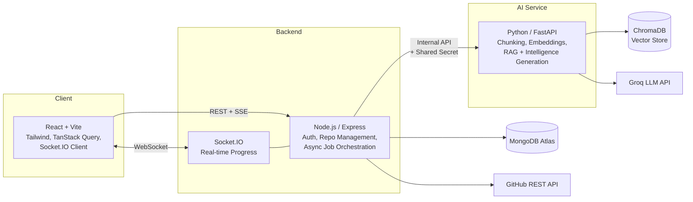

# AI Codebase Assistant

A full-stack platform that helps developers understand unfamiliar codebases faster — combining a real-time RAG (Retrieval-Augmented Generation) chat with an automated **Repository Intelligence** pipeline that generates architecture insights, API documentation, and an onboarding roadmap for any connected GitHub repository.

**Live demo:** [code-base-assistance.vercel.app](https://code-base-assistance.vercel.app)

> Note: the AI service runs on free-tier hosting with ephemeral storage — if the vector index appears empty after a period of inactivity, click **Re-index** before chatting. See [Deployment Notes](#deployment-notes).

---

## What it does

### 1. Chat with your codebase (RAG)
Connect a repository, index it (language-aware chunking → embeddings → vector store), then ask natural-language questions in a streaming chat interface, grounded in the actual source code with cited file sources. Supports multiple independent conversation threads per repository, with answer regeneration.

### 2. Automated Repository Intelligence
Trigger a one-click analysis that generates, in real time over WebSockets:
- **Tech Stack Detection** — languages, frameworks, package managers (deterministic, parsed from manifest files)
- **AI-Generated Summary** — grounded in the actual README, not generic filler
- **Architecture Overview + Module Explorer** — inferred from real folder structure, with each module's likely purpose and key files
- **API Explorer** — routes extracted directly from source code (Express, FastAPI, Flask), including verified auth-requirement flags
- **Learning Roadmap** — an ordered, onboarding-focused reading plan, grounded in the repo's own detected modules
- **Repository Health Dashboard** — largest modules, complexity hotspots, config files, TODO count

---

## Architecture



**Why two AI-driven features share one pipeline architecture:** both Chat and Repository Intelligence follow the same core pattern — Node orchestrates and persists, Python handles ML/LLM work, and results are scoped per-user, per-repository at the data layer. Repository Intelligence adds an async job + WebSocket layer on top, since generating six insight types (several requiring LLM calls) is too slow for a synchronous request/response cycle — a deliberate architectural evolution from the chat feature's simpler request/response model.

---

## Key engineering decisions

- **Deterministic over LLM wherever facts matter.** Tech stack detection, API route extraction, and health metrics are all computed via parsing/heuristics, not LLM inference — the LLM is only used to *describe* already-verified facts (route purposes, module summaries), never to invent them. This was a deliberate defense against hallucination risk in factual claims.
- **One batched LLM call per insight type, not one call per item.** Architecture/Module analysis, route descriptions, and the learning roadmap all send their full candidate set to Groq in a single request, rather than looping — controlling both latency and cost.
- **Isolated failure boundaries.** A failure generating one insight type (e.g., the roadmap) doesn't discard already-successfully-generated insights from earlier steps in the same pipeline run — each step persists independently.
- **Real-time progress via Socket.IO, authenticated and room-scoped.** WebSocket connections require the same JWT used for REST, and clients can only join a repository's progress room after a server-side ownership check — mirroring the `owner: userId` authorization pattern used throughout the REST API.
- **Honest UI disclosure of AI limitations.** Where an insight is inferred from structure rather than verified from content (e.g., module purposes), the UI says so explicitly rather than implying deeper analysis occurred.
- **Deployment-driven architecture swap.** The embedding pipeline originally used `sentence-transformers` (PyTorch-based) locally; hitting a 512MB memory ceiling on free-tier hosting led to swapping in `fastembed` (ONNX-based) with zero changes to the rest of the RAG pipeline.

---

## Tech Stack

**Frontend:** React (Vite), Tailwind CSS, React Router, TanStack Query, Axios, Socket.IO Client

**Backend:** Node.js, Express, Socket.IO, MongoDB (Mongoose), JWT Authentication

**AI Service:** Python, FastAPI, LangChain, ChromaDB, FastEmbed, Groq API

**External APIs:** GitHub REST API, Groq LLM API

**Deployment:** Vercel (frontend), Render (backend + AI service), MongoDB Atlas

---

## Project Structure

```text
├── client/ # React frontend
│ └── src/
│ ├── api/ # HTTP + WebSocket client wrappers
│ ├── components/ # Reusable UI components
│ ├── context/ # Auth context
│ ├── hooks/ # React Query + Socket.IO hooks
│ ├── lib/ # Socket.IO client singleton
│ ├── pages/ # Route-level pages
│ └── router/
│
├── server/ # Node/Express backend
│ └── src/
│ ├── config/ # Env validation, DB connection
│ ├── controllers/ # HTTP layer
│ ├── middlewares/ # Auth, validation, error handling
│ ├── models/ # Mongoose schemas
│ ├── routes/
│ ├── services/ # Business logic
│ ├── sockets/ # Socket.IO server + room auth
│ ├── utils/ # Deterministic detectors (tech stack, routes, health, modules)
│ └── validators/ # Zod schemas
│
└── ai-service/ # Python/FastAPI AI service
└── app/
├── api/routes/ # FastAPI routers
├── core/ # Config, security
├── schemas/ # Pydantic models
└── services/ # Chunking, embeddings, retrieval, LLM, insight generation
```
---

## Running Locally

### Prerequisites
- Node.js 18+
- Python 3.11.x
- MongoDB Atlas account (free tier)
- Groq API key ([console.groq.com](https://console.groq.com))
- GitHub Personal Access Token (optional, for private repos)

### 1. Backend
```bash
cd server
npm install
cp .env.example .env
npm run dev
```

### 2. AI Service
```bash
cd ai-service
python -m venv venv
venv\Scripts\activate
pip install -r requirements.txt
cp .env.example .env
uvicorn app.main:app --reload --port 8000
```

### 3. Frontend
```bash
cd client
npm install
cp .env.example .env
npm run dev
```

Visit `http://localhost:5173`.

---

## API Overview

| Method | Endpoint | Description |
|---|---|---|
| POST | `/api/auth/register` \| `/login` | Authentication |
| POST | `/api/repos` | Connect a GitHub repository |
| POST | `/api/repos/:id/index` | Index a repository into the vector store |
| POST | `/api/repos/:repoId/sessions` | Create a chat conversation |
| POST | `/api/sessions/:sessionId/query` | Ask a question (SSE stream) |
| POST | `/api/repos/:id/analyze` | Trigger repository intelligence analysis (`202`, async) |
| GET | `/api/repos/:id/insights` | Fetch current insight data |
| WS | `join:repo` / `insight:progress` / `insight:completed` | Real-time analysis progress |

---

## Deployment Notes

Deployed on free-tier infrastructure. Two real tradeoffs worth being explicit about:

1. Render's free web services use an ephemeral filesystem, wiped on restart/spin-down — the on-disk vector store resets after ~15 minutes of inactivity. A production deployment would use a persistent disk or managed vector database (drop-in swaps behind `vectorstore_service.py`).
2. WebSocket connections are dropped when the free Node service spins down from inactivity — reconnection is handled client-side on next page load, but there's currently no mid-analysis reconnection/replay if a job was running during a spin-down.


